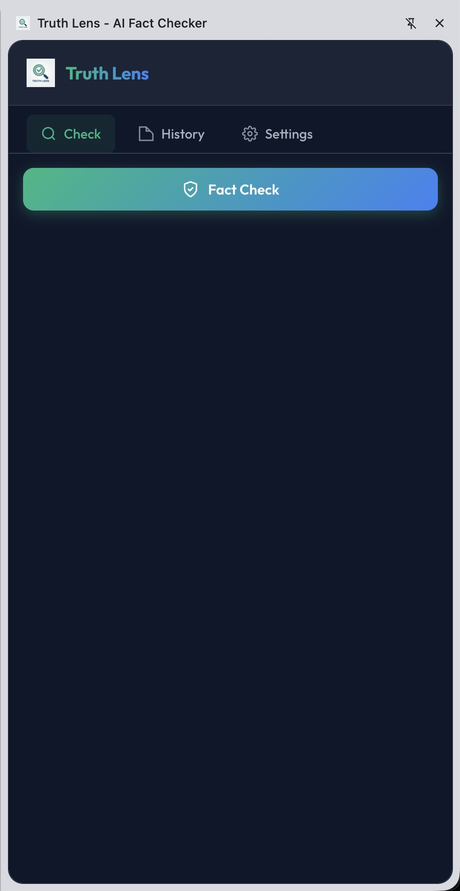
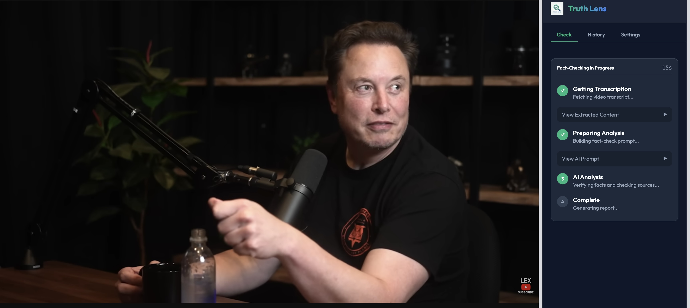
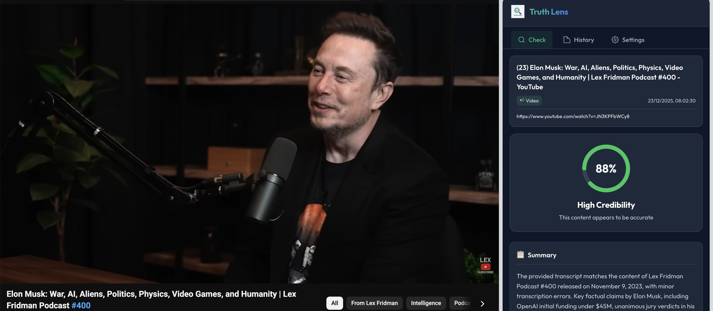
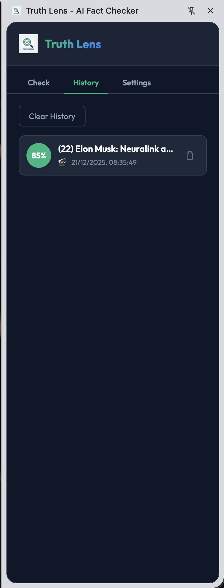
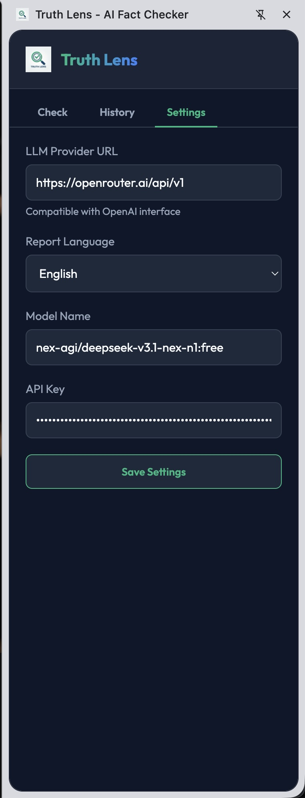

# 🔍 Truth Lens - AI Fact Checker & Learning Companion

A Chrome extension that combines **AI-powered fact-checking** with **educational content generation**. While you read articles or watch YouTube videos, Truth Lens analyzes the content, verifies claims against web sources, and generates an educational summary to help you learn and remember what matters.

---

## ✨ Features

### Core Fact-Checking
- **One-Click Analysis** - Click the extension icon to analyze the current page
- **YouTube Support** - Automatically extracts video transcripts (via NoteGPT & yt-to-text APIs)
- **Selection Fact Check** - Select any text on a page, right-click, and choose "Fact Check with Truth Lens" to verify specific content
- **Web Search Verification** - AI performs DuckDuckGo searches to cross-reference claims with reliable sources
- **Live Progress Tracking** - Watch step-by-step progress as the extension extracts content, searches the web, and generates your report

### Report & Analysis
- **Trust Score (0-100%)** - Visual credibility rating with color-coded indicator
- **Claim-by-Claim Analysis** - Each claim gets a verdict (Verified, False, Misleading, etc.)
- **Bias Detection** - Identifies political, emotional, or framing bias
- **Missing Context** - Highlights important context that may be omitted
- **Source References** - Links to web sources used for verification

### Educational Content
- **Key Takeaways** - The most important points extracted from the content
- **Concepts Explained** - Complex terms and ideas broken down simply
- **Facts to Remember** - Specific data, statistics, and quotes worth retaining
- **Context & Background** - Additional context to deepen understanding

### User Experience
- **Side Panel UI** - Non-intrusive interface that stays alongside your browsing
- **Check History** - Automatically saves all fact-checks for later review
- **Tab-Aware State** - Each browser tab maintains its own analysis state
- **Progress Indicators** - Step-by-step progress with expandable details
- **Caching** - Previously checked content loads instantly

### Internationalization
- **10 Languages Supported:**
  - 🇺🇸 English
  - 🇸🇦 Arabic (with full RTL support)
  - 🇫🇷 French
  - 🇩🇪 German
  - 🇪🇸 Spanish
  - 🇮🇹 Italian
  - 🇵🇹 Portuguese
  - 🇷🇺 Russian
  - 🇨🇳 Chinese (Simplified)
  - 🇯🇵 Japanese

### Customization
- **Bring Your Own Model** - Use any OpenAI-compatible API
- **Configurable Provider** - Works with OpenRouter, OpenAI, local LLMs, etc.
- **Language Selection** - Choose your preferred report language

---

## 📸 Screenshots

| Home | Analysis | Report | History | Settings |
|------|----------|--------|---------|----------|
|  |  |  |  |  |

---

## 🚀 Installation

1. **Download** this repository (clone or download ZIP)
2. Open Chrome and go to `chrome://extensions`
3. Enable **Developer mode** (toggle in top right)
4. Click **Load unpacked**
5. Select the `truth-lens` folder
6. ✅ Truth Lens icon appears in your toolbar

---

## ⚙️ Configuration

### Step 1: Get an API Key

1. Go to [OpenRouter.ai](https://openrouter.ai/)
2. Sign up and go to **Keys** settings
3. Generate a new API Key (starts with `sk-or-...`)

### Step 2: Configure the Extension

1. Click the Truth Lens icon to open the side panel
2. Go to **Settings** tab
3. Enter your configuration:
   - **Provider URL**: `https://openrouter.ai/api/v1`
   - **Model**: `nex-agi/deepseek-v3.1-nex-n1:free` (free tier)
   - **API Key**: Your OpenRouter key
   - **Language**: Select your preferred language
4. Click **Save**

---

## 🔧 How It Works

```
1. Content Extraction
   ├── Web Pages: Article text, metadata, structured data
   └── YouTube: Video title, description, transcript

2. AI Analysis (with web search)
   ├── Claim identification
   ├── Live web searches via DuckDuckGo
   ├── Cross-reference with sources
   └── Bias & context analysis

3. Report Generation
   ├── Trust score calculation
   ├── Per-claim verdicts
   ├── Source citations
   └── Educational summary
```

---

## 🛠️ Technical Stack

| Component | Technology |
|-----------|------------|
| Extension | Chrome Manifest V3 |
| UI | Vanilla JavaScript, CSS Variables |
| AI Backend | OpenAI-compatible API (OpenRouter) |
| Web Search | DuckDuckGo Lite scraping |
| Transcripts | NoteGPT API, yt-to-text.com |

### Key Permissions
- `sidePanel` - Side panel UI
- `storage` - Settings & history persistence
- `contextMenus` - Right-click fact-checking
- `tabs` - Tab state management
- `activeTab` - Content extraction

---

## 📁 Project Structure

```
truth-lens/
├── manifest.json        # Extension manifest
├── html/
│   └── index.html       # Side panel UI
├── css/
│   ├── base.css         # Variables, RTL support
│   ├── progress.css     # Progress indicators
│   └── result.css       # Report styling
├── js/
│   ├── background.js    # Context menu, side panel
│   ├── content/         # Page & YouTube extraction
│   ├── core/            # DOM, state, storage
│   ├── features/        # Check, history, result, settings
│   ├── i18n/            # Translations (10 languages)
│   ├── llm/             # AI service, prompts
│   └── tools/           # Web search (DuckDuckGo)
└── icons/               # Extension icons
```

---

## 🌐 Supported Content Types

| Type | Method |
|------|--------|
| News Articles | Article content extraction |
| Blog Posts | Main content detection |
| YouTube Videos | Transcript API extraction |
| Generic Pages | Body text with cleaning |
| Selected Text | Right-click context menu |

---

## ⚡ Verdict Types

| Verdict | Meaning |
|---------|---------|
| ✅ VERIFIED | Claim confirmed by reliable sources |
| ✅ TRUE | Factually accurate |
| ⚠️ MOSTLY TRUE | True with minor inaccuracies |
| ⚠️ MIXED | Contains both true and false elements |
| ⚠️ MISLEADING | Technically true but framed deceptively |
| ❌ FALSE | Factually incorrect |
| ❌ FABRICATED | Entirely made up |
| 🎭 SATIRE | Intentional parody/humor |
| ❓ UNVERIFIABLE | Cannot be confirmed or denied |
| 💭 OPINION | Subjective statement, not a claim |

---

## 📄 License

MIT License - Feel free to use, modify, and distribute.

---

Built with ❤️ using Vanilla JS and AI
